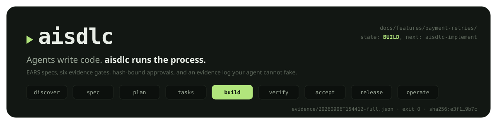
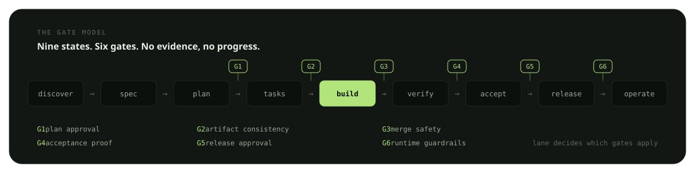

<div align="center">

<picture>
  <source media="(prefers-color-scheme: dark)" srcset="assets/hero-dark.svg">
  <source media="(prefers-color-scheme: light)" srcset="assets/hero-light.svg">
  
</picture>

<br>

[](https://github.com/AnshRoshan/aisdlc/actions/workflows/ci.yml)
[](https://www.npmjs.com/package/aisdlc)
[](packages/cli/package.json)
[](LICENSE)
[](https://anshroshan.github.io/aisdlc/)
[](#the-18-skills)

A process kit for AI-assisted engineering that installs into any coding agent.
EARS specs, six evidence gates, hash-bound human approvals, and an evidence log
your agent cannot fake with prose. Local-first: no server, no account, no telemetry.

</div>

<br>

## Install

<table>
<tr>
<th width="33%" align="left"><sub>NPM · ALL HARNESSSES</sub></th>
<th width="33%" align="left"><sub>CLAUDE CODE PLUGIN</sub></th>
<th width="33%" align="left"><sub>SKILLS.SH · SKILLS ONLY</sub></th>
</tr>
<tr>
<td valign="top">

```bash
npx aisdlc init
```

Skills + instructions + slash commands, detected for your harness. Also: `aisdlc new`, `next`, `verify`, `approve`, `doctor`.

</td>
<td valign="top">

```
/plugin marketplace add AnshRoshan/aisdlc
/plugin install aisdlc@aisdlc
```

18 skills plus the `/aisdlc-next` and `/aisdlc-status` commands, updated through the plugin system.

</td>
<td valign="top">

```bash
npx skills add AnshRoshan/aisdlc
```

The skills only, symlinked into every harness it finds. One skill: `--skill aisdlc-debug`.

</td>
</tr>
</table>

`aisdlc init` detects **Claude Code, Codex CLI, Cursor, Gemini CLI, GitHub Copilot, Windsurf and OpenCode**, writes the canonical copy to `.agents/skills/`, per-harness copies (or symlinks with `--link`), the process tree in `docs/`, and an `aisdlc.json` marker. Then talk to your agent:

```bash
use aisdlc-brainstorm, I want to build payment retries
```

> It classifies the work into a lane, interviews you with recommended answers, and routes to the right skill. Every stage ends with `npx aisdlc next`, and the agent obeys the disk, not the chat.

## Why

<table>
<tr><th width="30%" align="left">You have probably heard</th><th width="35%" align="left">What actually happened</th><th width="35%" align="left">What aisdlc does</th></tr>
<tr><td>"All tests pass."</td><td>Nothing ran. The agent wrote the sentence it predicted you wanted.</td><td>Only counts a run it recorded itself: command, exit code, output hash.</td></tr>
<tr><td>The spec drifted at 2 a.m.</td><td>A requirement was quietly rewritten to match the code.</td><td>Turns the edit into a delta, invalidates stale approvals, moves state backwards on purpose.</td></tr>
<tr><td>The agent approved its own plan.</td><td>Segregation of duties is a policy nobody enforces on a Friday.</td><td>Refuses approvals from the author, and refuses agents entirely.</td></tr>
</table>

## The gate model

<picture>
  <source media="(prefers-color-scheme: dark)" srcset="assets/flow-dark.svg">
  <source media="(prefers-color-scheme: light)" srcset="assets/flow-light.svg">
  
</picture>

The agent runs `npx aisdlc next`, gets the state and the skill to load, does the work, and runs it again. Humans are asked for exactly two things: **signatures and approvals**. Every check is a pure function over files (`packages/cli/src/engine.js`): same files, same answer, any machine. That is what makes it auditable.

<details open>
<summary><strong>Lanes: how much process a feature carries</strong> (set by <code>aisdlc-brainstorm</code>, ratchets only up)</summary>
<br>

| lane | required gates | spec signature | typical |
|---|---|---|---|
| `spike` | G3 | not required | feasibility question; output is an answer |
| `quick` | G2, G3, G4 | required | bounded change to an existing flow; bug fix |
| `standard` | G1–G6 | required | new capability |
| `regulated` | G1–G6, two approvers | required | money, PII, auth, irreversible data, public contracts |

</details>

<details>
<summary><strong>The eight invariants</strong> (written to <code>docs/constitution.md</code> and your agent's instructions file on <code>init</code>)</summary>
<br>

1. **The spec is the source of truth.** Code is generated output. Intent changes go through a delta, never a quiet edit.
2. **Gates are transitions, not suggestions.** No evidence, no progress.
3. **Approver is never the author**, and agents cannot approve at all.
4. **Humans own the acceptance bar.** `Approved-by:` lines are human-signed.
5. **Done means a recorded run** in `evidence/`. Claims without artifacts do not count.
6. **Disk is state, chat is not.** Same files, same answer, any machine, any model.
7. **Secrets never land in files.** Placeholders only. Fail closed.
8. **Fail loud, never fake green.** Infra down means `IMPLEMENTED-NOT-VERIFIED`, not PASS.

</details>

## The 18 skills

<table>
<tr>
<th width="33%" align="left"><sub>ENTRY</sub></th>
<th width="33%" align="left"><sub>SPECIFY → BUILD</sub></th>
<th width="33%" align="left"><sub>VERIFY → SHIP</sub></th>
</tr>
<tr>
<td valign="top">

- [`aisdlc-flow`](skills/aisdlc-flow/SKILL.md) — the router
- [`aisdlc-brainstorm`](skills/aisdlc-brainstorm/SKILL.md)
- [`aisdlc-discover`](skills/aisdlc-discover/SKILL.md)
- [`aisdlc-brownfield`](skills/aisdlc-brownfield/SKILL.md)
- [`aisdlc-taste`](skills/aisdlc-taste/SKILL.md)
- [`aisdlc-spec`](skills/aisdlc-spec/SKILL.md)

</td>
<td valign="top">

- [`aisdlc-plan`](skills/aisdlc-plan/SKILL.md)
- [`aisdlc-tasks`](skills/aisdlc-tasks/SKILL.md)
- [`aisdlc-implement`](skills/aisdlc-implement/SKILL.md)
- [`aisdlc-debug`](skills/aisdlc-debug/SKILL.md)
- [`aisdlc-verify`](skills/aisdlc-verify/SKILL.md)
- [`aisdlc-review`](skills/aisdlc-review/SKILL.md)

</td>
<td valign="top">

- [`aisdlc-release`](skills/aisdlc-release/SKILL.md)
- [`aisdlc-retro`](skills/aisdlc-retro/SKILL.md)
- [`aisdlc-grill`](skills/aisdlc-grill/SKILL.md)
- [`aisdlc-ponytail`](skills/aisdlc-ponytail/SKILL.md)
- [`aisdlc-delta`](skills/aisdlc-delta/SKILL.md)
- [`aisdlc-handoff`](skills/aisdlc-handoff/SKILL.md)

</td>
</tr>
</table>

Plain Markdown in the open Agent Skills format, read identically by every harness above. Bridges to the official [ponytail](https://github.com/DietrichGebert/ponytail) and [grilling](https://github.com/mattpocock/skills) skills when they are installed; works without them.

## Repo layout

| path | what |
|---|---|
| [`skills/`](skills/) | the 18 canonical skills (source of truth) |
| [`packages/cli/`](packages/cli/) | zero-dependency Node CLI (Node ≥ 18), installed as `npx aisdlc` |
| [`commands/`](commands/) | Claude Code plugin slash commands (`/aisdlc-next`, `/aisdlc-status`) |
| [`.claude-plugin/`](.claude-plugin/) | plugin manifest + marketplace listing |
| [`site/`](site/) | Astro static site, deployed to GitHub Pages |
| [`docs/RESEARCH.md`](docs/RESEARCH.md) | design decisions and their sources (Spec Kit, BMAD, superpowers, ponytail, grilling) |

<details>
<summary><strong>CLI reference</strong></summary>
<br>

```
aisdlc init      install skills + process scaffolding into a repo
aisdlc new       open a feature with a lane
aisdlc next      derive state; print blocking items and the next skill
aisdlc status    list every feature and its state
aisdlc verify    run a command and record evidence
aisdlc approve   human gate approval (G1, G5, acceptance)
aisdlc lane      raise a feature's lane (never lowers)
aisdlc doctor    check installation health
```

</details>

## FAQ

<details>
<summary><strong>Is this a SaaS? Do I need an account?</strong></summary>
<br>
No. It is a folder of SKILL.md files and a zero-dependency Node CLI. Everything runs on your machine against your own repo.
</details>

<details>
<summary><strong>Which model or subscription do I need?</strong></summary>
<br>
Whatever you already have. The skills are plain Markdown; Claude Code, Codex, Cursor, Gemini, Copilot, Windsurf, OpenCode and local open-weight models all read them the same way.
</details>

<details>
<summary><strong>How is this different from Spec Kit or BMAD?</strong></summary>
<br>
Those give you excellent templates and advice. aisdlc adds enforcement: approvals bound to artifact hashes that go stale when you edit, an evidence log that cannot be faked by prose, and segregation of duties the agent cannot bypass.
</details>

<details>
<summary><strong>Can I use it on an existing codebase?</strong></summary>
<br>
Yes, <code>aisdlc-brownfield</code>: baseline, characterization tests and named seams before any delta-only change is allowed.
</details>

<details>
<summary><strong>Is it free?</strong></summary>
<br>
MIT. Fork it, vendor it, ship it inside your company. If you find it useful, star the repo and file issues.
</details>

---

<div align="center">

**Contributing** · see [CONTRIBUTING.md](CONTRIBUTING.md): skills are prose, the CLI is law. Behaviour goes in a SKILL.md; anything that must be enforced deterministically goes in `packages/cli/src/engine.js` as a pure function over files.

**[MIT](LICENSE)** © Ansh Roshan · [docs](https://anshroshan.github.io/aisdlc/) · [CHANGELOG](CHANGELOG.md)

</div>
