<div align="center">

# aisdlc

**Agents write code. aisdlc runs the process.**

A process kit for AI-assisted engineering that installs into any coding agent.
EARS specs, six evidence gates, hash-bound human approvals, and an evidence
log your agent cannot fake with prose. Local-first: no server, no account,
no telemetry.

[](https://github.com/AnshRoshan/aisdlc/actions/workflows/ci.yml)
[](https://www.npmjs.com/package/aisdlc)
[](package.json)
[](LICENSE)
[](https://anshroshan.github.io/aisdlc/)
[](skills/)

`npx aisdlc init`

*run this inside the repo you are already working on*

</div>

---

## Install

| Method | Command | What you get |
|---|---|---|
| **npm / npx** | `npx aisdlc init` | skills + instructions + slash commands, detected for your harness |
| **Claude Code plugin** | `/plugin marketplace add AnshRoshan/aisdlc`<br>`/plugin install aisdlc@aisdlc` | skills + `/aisdlc-next`, `/aisdlc-status` commands, updated via the plugin system |
| **skills.sh** | `npx skills add AnshRoshan/aisdlc` | the 18 skills only, into every harness it finds |
| **One skill** | `npx skills add AnshRoshan/aisdlc --skill aisdlc-debug` | just that skill |
| **Manual** | `git clone https://github.com/AnshRoshan/aisdlc` and copy `skills/` | full control, no CLI |

`npx aisdlc init` detects Claude Code, Codex CLI, Cursor, Gemini CLI, GitHub Copilot, Windsurf and OpenCode, writes the canonical copy to `.agents/skills/`, per-harness copies (or symlinks with `--link`), the process tree in `docs/`, and an `aisdlc.json` marker.

Then talk to your agent:

```
use aisdlc-brainstorm, I want to build payment retries
```

It classifies the work into a lane, interviews you with recommended answers, and routes to the right skill. Every stage ends with `npx aisdlc next`, and the agent obeys the disk, not the chat.

## Why

| You have probably heard | What actually happened | What aisdlc does |
|---|---|---|
| "All tests pass." | Nothing ran. The agent wrote the sentence it predicted you wanted. | Only counts a run it recorded itself: command, exit code, output hash. |
| The spec drifted at 2 a.m. | A requirement was quietly rewritten to match the code. | Turns the edit into a delta, invalidates stale approvals, moves state backwards on purpose. |
| The agent approved its own plan. | Segregation of duties is a policy nobody enforces on a Friday. | Refuses approvals from the author, and refuses agents entirely. |

## How it works

The agent runs `npx aisdlc next`, gets the state and the skill to load, does the work, and runs it again. Humans are asked for exactly two things: signatures and approvals.

```mermaid
flowchart LR
    D[Discover] --> S[Spec] --> P[Plan] --> T[Tasks] --> B[Build] --> V[Verify] --> A[Accept] --> R[Release] --> O[Operate]
    P -. "G1 plan approval" .-> T
    T -. "G2 artifact consistency" .-> B
    B -. "G3 merge safety" .-> V
    V -. "G4 acceptance proof" .-> A
    A -. "G5 release approval" .-> R
    R -. "G6 runtime guardrails" .-> O
```



Every check is a pure function over files (`packages/cli/src/engine.js`). Same files, same answer, any machine. That is what makes it auditable.

### Lanes

How much process a feature carries. Set by `aisdlc-brainstorm`, ratchets only up.

| lane | required gates | spec signature | typical |
|---|---|---|---|
| `spike` | G3 | not required | feasibility question; output is an answer |
| `quick` | G2, G3, G4 | required | bounded change to an existing flow; bug fix |
| `standard` | G1–G6 | required | new capability |
| `regulated` | G1–G6, two approvers | required | money, PII, auth, irreversible data, public contracts |

### The gates

| gate | name | refuses to pass when |
|---|---|---|
| **G1** | Plan approval | plan is a stub, approval not bound to its hash, or approver = author |
| **G2** | Artifact consistency | spec fails EARS validation, §5 unsigned, or a requirement has no task |
| **G3** | Merge safety | secrets scan is dirty, or the full test run is not recorded as evidence |
| **G4** | Acceptance proof | a scenario has no evidence file, a row fails, or sign-off is missing |
| **G5** | Release approval | rollout has no concrete rollback steps, or no release-owner approval |
| **G6** | Runtime guardrails | budgets, a named kill switch, or a runbook is missing |

### The eight invariants

Landed into `docs/constitution.md` and your agent's instructions file on `init`.

1. **The spec is the source of truth.** Code is generated output. Intent changes go through a delta, never a quiet edit.
2. **Gates are transitions, not suggestions.** No evidence, no progress.
3. **Approver is never the author**, and agents cannot approve at all.
4. **Humans own the acceptance bar.** `Approved-by:` lines are human-signed.
5. **Done means a recorded run** in `evidence/`. Claims without artifacts do not count.
6. **Disk is state, chat is not.** Same files, same answer, any machine, any model.
7. **Secrets never land in files.** Placeholders only. Fail closed.
8. **Fail loud, never fake green.** Infra down means `IMPLEMENTED-NOT-VERIFIED`, not PASS.

## The 18 skills

| stage | skill |
|---|---|
| entry | [`aisdlc-flow`](skills/aisdlc-flow/SKILL.md) (router) · [`aisdlc-brainstorm`](skills/aisdlc-brainstorm/SKILL.md) · [`aisdlc-discover`](skills/aisdlc-discover/SKILL.md) · [`aisdlc-brownfield`](skills/aisdlc-brownfield/SKILL.md) · [`aisdlc-taste`](skills/aisdlc-taste/SKILL.md) |
| specify → build | [`aisdlc-spec`](skills/aisdlc-spec/SKILL.md) · [`aisdlc-plan`](skills/aisdlc-plan/SKILL.md) · [`aisdlc-tasks`](skills/aisdlc-tasks/SKILL.md) · [`aisdlc-implement`](skills/aisdlc-implement/SKILL.md) · [`aisdlc-debug`](skills/aisdlc-debug/SKILL.md) |
| verify → ship | [`aisdlc-verify`](skills/aisdlc-verify/SKILL.md) · [`aisdlc-review`](skills/aisdlc-review/SKILL.md) · [`aisdlc-release`](skills/aisdlc-release/SKILL.md) · [`aisdlc-retro`](skills/aisdlc-retro/SKILL.md) |
| cross-cutting | [`aisdlc-grill`](skills/aisdlc-grill/SKILL.md) · [`aisdlc-ponytail`](skills/aisdlc-ponytail/SKILL.md) · [`aisdlc-delta`](skills/aisdlc-delta/SKILL.md) · [`aisdlc-handoff`](skills/aisdlc-handoff/SKILL.md) |

Plain Markdown in the open Agent Skills format, read identically by every harness above. Bridges to the official [ponytail](https://github.com/DietrichGebert/ponytail) and [grilling](https://github.com/mattpocock/skills) skills when they are installed; works without them.

## Repo layout

| path | what |
|---|---|
| `skills/` | the 18 canonical skills (source of truth) |
| `packages/cli/` | zero-dependency Node CLI (Node ≥ 18), installed as `npx aisdlc` |
| `commands/` | Claude Code plugin slash commands (`/aisdlc-next`, `/aisdlc-status`) |
| `.claude-plugin/` | Claude Code plugin manifest + marketplace listing |
| `site/` | Astro static site, deployed to GitHub Pages |
| `docs/RESEARCH.md` | design decisions and their sources (Spec Kit, BMAD, superpowers, ponytail, grilling) |

## CLI reference

```
aisdlc init      install skills + process scaffolding into a repo
aisdlc new       open a feature with a lane
aisdlc next      derive state; print blocking items and the next skill
aisdlc status    list every feature and its state
aisdlc verify    run a command and record evidence
aisdlc approve   human gate approval (G1, G5, acceptance)
aisdlc lane      raise a feature's lane (never lowers)
aisdlc doctor    check installation health
```

## FAQ

<details>
<summary><strong>Is this a SaaS? Do I need an account?</strong></summary>
No. It is a folder of SKILL.md files and a zero-dependency Node CLI. Everything runs on your machine against your own repo.
</details>
<details>
<summary><strong>Which model or subscription do I need?</strong></summary>
Whatever you already have. The skills are plain Markdown; Claude Code, Codex, Cursor, Gemini, Copilot, Windsurf, OpenCode and local open-weight models all read them the same way.
</details>
<details>
<summary><strong>How is this different from Spec Kit or BMAD?</strong></summary>
Those give you excellent templates and advice. aisdlc adds enforcement: approvals bound to artifact hashes that go stale when you edit, an evidence log that cannot be faked by prose, and segregation of duties the agent cannot bypass.
</details>
<details>
<summary><strong>Can I use it on an existing codebase?</strong></summary>
Yes, <code>aisdlc-brownfield</code>: baseline, characterization tests and named seams before any delta-only change is allowed.
</details>
<details>
<summary><strong>Is it free?</strong></summary>
MIT. Fork it, vendor it, ship it inside your company. If you find it useful, star the repo and file issues.
</details>

## Contributing

See [CONTRIBUTING.md](CONTRIBUTING.md). The short version: skills are prose, the CLI is law; behaviour goes in a SKILL.md, anything that must be enforced deterministically goes in `packages/cli/src/engine.js` as a pure function over files. `npm test` in `packages/cli` must pass on Node 18/20/22.

## License

[MIT](LICENSE) © Ansh Roshan
