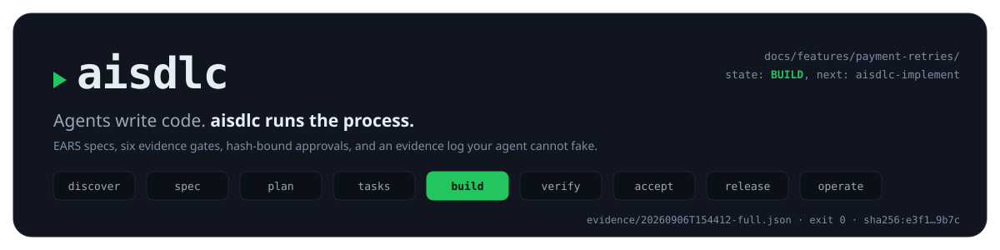
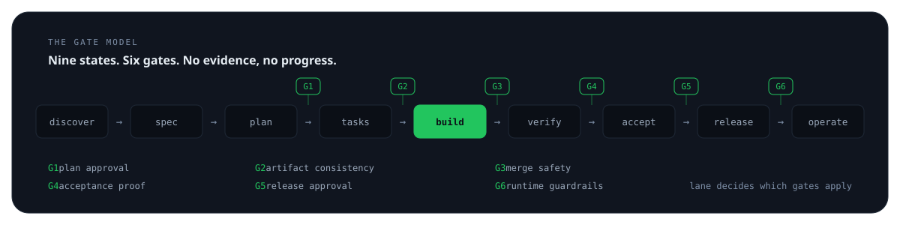

<div align="center">

<picture>
  <source media="(prefers-color-scheme: dark)" srcset="assets/hero-dark.svg">
  <source media="(prefers-color-scheme: light)" srcset="assets/hero-light.svg">
  
</picture>

<br>

[](https://github.com/AnshRoshan/aisdlc/actions/workflows/ci.yml)
[](#the-20-skills)
[](packages/cli/package.json)
[](LICENSE)

A process kit for AI-assisted engineering that installs into any coding agent.
EARS specs, six evidence gates, hash-bound human approvals, and an evidence log
your agent cannot fake with prose. Local-first: no server, no account, no telemetry.

</div>

<br>

## Install

<table>
<tr>
<th width="33%" align="left"><sub>CLAUDE CODE PLUGIN</sub></th>
<th width="33%" align="left"><sub>SKILLS.SH · SKILLS ONLY</sub></th>
<th width="33%" align="left"><sub>NPM · CLI + SKILLS</sub></th>
</tr>
<tr>
<td valign="top">

```
/plugin marketplace add AnshRoshan/aisdlc
/plugin install aisdlc@aisdlc
```

20 skills, the guard mod, and the `/aisdlc-next`, `/aisdlc-status` and `/aisdlc-report` commands, updated through the plugin system.

</td>
<td valign="top">

```bash
npx skills add AnshRoshan/aisdlc
```

The skills only, symlinked into every harness it finds. One skill: `--skill aisdlc-debug`.

</td>
<td valign="top">

```bash
git clone https://github.com/AnshRoshan/aisdlc
node aisdlc/packages/cli/bin/aisdlc.js init --harness all
```

Not published to the registry yet; `aisdlc-cli` is cut on the next release, then this cell becomes
`npx aisdlc-cli init`. The two paths beside it install the skills today, and the CLI above installs
skills, instructions, slash commands **and** the read-only subagents, detected for your harness.

</td>
</tr>
</table>

`aisdlc init` detects **Claude Code, Codex CLI, Cursor, Gemini CLI, GitHub Copilot, Windsurf and OpenCode**, writes the canonical copy to `.agents/skills/`, per-harness copies (or symlinks with `--link`), the process tree in `docs/`, and an `aisdlc.json` marker. Then talk to your agent:

```bash
use aisdlc-brainstorm, I want to build payment retries
```

> It classifies the work into a lane, interviews you with recommended answers, and routes to the right skill. Every stage ends with `npx aisdlc-cli next`, and the agent obeys the disk, not the chat.

## Where to start

| you have | start here |
|---|---|
| a new idea, nothing written yet | `aisdlc-brainstorm` → it picks the lane, then routes to `aisdlc-discover` → `aisdlc-spec` |
| an existing codebase you must not break | `aisdlc-brownfield` first: baseline, characterization tests, named seams, then the normal spine |
| one bounded change or a bug | `aisdlc new "…" --lane quick`, then `aisdlc-flow`; `aisdlc-debug` when it misbehaves |
| a spec that changed after signature | `aisdlc-delta` - never a quiet edit; approvals go stale on purpose |
| no idea where a feature actually is | `aisdlc next <feature>` (or `aisdlc-flow`, which reads the same disk) |

## Why

<table>
<tr><th width="30%" align="left">You have probably heard</th><th width="35%" align="left">What actually happened</th><th width="35%" align="left">What aisdlc does</th></tr>
<tr><td>"All tests pass."</td><td>Nothing ran. The agent wrote the sentence it predicted you wanted.</td><td>Only counts a run it recorded itself: command, exit code, output hash.</td></tr>
<tr><td>The spec drifted at 2 a.m.</td><td>A requirement was quietly rewritten to match the code.</td><td>Turns the edit into a delta, invalidates stale approvals, moves state backwards on purpose.</td></tr>
<tr><td>The agent approved its own plan.</td><td>Segregation of duties is a policy nobody enforces on a Friday.</td><td>Refuses approvals from the author, and refuses agents entirely.</td></tr>
<tr><td>The review agreed with the code.</td><td>The model that wrote it reviewed it, saw its own reasoning, and called it clean.</td><td>G4 records the author model and the reviewer model, and fails a match. No second family available means saying `degraded`, out loud, in the artifact.</td></tr>
</table>

## The gate model

<picture>
  <source media="(prefers-color-scheme: dark)" srcset="assets/flow-dark.svg">
  <source media="(prefers-color-scheme: light)" srcset="assets/flow-light.svg">
  
</picture>

The agent runs `npx aisdlc-cli next`, gets the state and the skill to load, does the work, and runs it again. Humans are asked for exactly two things: **signatures and approvals**. Every check is a pure function over files (`packages/cli/src/engine.js`): same files, same answer, any machine. That is what makes it auditable.

### Hard mode: the Claude Code mod

Comes with the plugin install, nothing to enable. The CLI is the referee, but a referee only sees what
gets reported to it. `hooks/aisdlc-guard.mjs` is a
Claude Code [mod](https://code.claude.com/docs/en/plugins/mods/overview) - code that runs inside the
agent's process - and it closes the three holes that cost the most:

| it holds | because |
|---|---|
| a bare `npm test` / `pytest` / `cargo test` while a feature is open | the run records nothing; re-run it as `aisdlc evidence <feature> --label full -- …` (invariant 5) |
| any `aisdlc approve` the agent tries to run | approvals are human actions, refused before the call rather than after (invariants 3 and 4) |
| an edit to a signed `spec.md`, or a hand-written `Approved-by:` line | intent changes go through a delta; the signature is yours (invariants 1 and 4) |
| a write to `evidence/` or `approvals.json` | those are the files the gates trust; a hand-made one is a forged one |

It also reads `aisdlc next` once per turn and puts the real state in front of the model *and* in your
status line, so "where are we" has an answer you did not have to ask for. Everything else stays the
portable contract: the mod is an accelerator for one harness, it fails open when it cannot decide, and
the other six harnesses lose nothing but the interception.

<details open>
<summary><strong>Lanes: how much process a feature carries</strong> (set by <code>aisdlc-brainstorm</code>, ratchets only up)</summary>
<br>

| lane | required gates | spec signature | typical |
|---|---|---|---|
| `spike` | G3 | not required | feasibility question; output is an answer |
| `quick` | G2, G3, G4 | required | bounded change to an existing flow; bug fix |
| `standard` | G1–G6 | required | new capability |
| `regulated` | G1–G6, two approvers | required | money, PII, auth, irreversible data, public contracts |

</details>

<details>
<summary><strong>The eight invariants</strong> (written to <code>docs/constitution.md</code> and your agent's instructions file on <code>init</code>)</summary>
<br>

1. **The spec is the source of truth.** Code is generated output. Intent changes go through a delta, never a quiet edit.
2. **Gates are transitions, not suggestions.** No evidence, no progress.
3. **Approver is never the author**, and agents cannot approve at all.
4. **Humans own the acceptance bar.** `Approved-by:` lines are human-signed.
5. **Done means a recorded run** in `evidence/`. Claims without artifacts do not count.
6. **Disk is state, chat is not.** Same files, same answer, any machine, any model.
7. **Secrets never land in files.** Placeholders only. Fail closed.
8. **Fail loud, never fake green.** Infra down means `IMPLEMENTED-NOT-VERIFIED`, not PASS.

</details>

## Who writes what

State lives in files, so *who may touch each file* is the part that decides whether a project
survives many sessions and many agents. One owner per artifact; `evidence/` and `approvals.json` are
written by the CLI and by nobody else, which is what makes them evidence rather than prose.

| artifact | written by | read by | who may change it |
|---|---|---|---|
| `aisdlc.json` | `aisdlc init` | every CLI command | you: policy, harnesses, `test.gate` |
| `docs/constitution.md` | init, then `aisdlc-retro` | every stage | amendment a human agrees to |
| `docs/taste.md` | `aisdlc-taste` | plan, implement, review | you; retro proposes edits |
| `docs/brief.md` | `aisdlc-discover` | brainstorm, spec, retro | a new discovery run, not an edit |
| `docs/glossary.md` | discover or taste, then anyone who meets a new term | spec, plan, tasks, review | additive, one line per term |
| `docs/decisions/*.md` | `aisdlc-plan` for cross-feature calls | plan, review | supersedes with a new ADR; never rewritten |
| `spec.md` | `aisdlc-spec` | plan, tasks, implement, verify, review | **only** through `aisdlc-delta` once signed |
| `plan.md` | `aisdlc-plan` | tasks, implement | author until G1; an edit after G1 makes the approval stale on purpose |
| `tasks.md` | `aisdlc-tasks` | implement, verify | `aisdlc-implement` checks boxes; only tasks/plan adds or reorders them |
| `acceptance.md` | `aisdlc-review` | verify, release, the human | reviewer fills rows, **only a human signs** |
| `rollout.md`, `guardrails.yaml`, `runbook.md` | `aisdlc-release` | operate, retro | before G5/G6; after, through a delta |
| `deltas/*.md` | `aisdlc-delta` | spec, plan, tasks | author writes, human decides |
| `evidence/*.json` | the CLI, from a run it spawned | `next`, G3, G4, review | nobody. Appending-only; an edited run is a forged run |
| `approvals.json` | the CLI, from `aisdlc approve` | every gate | nobody. The hash chain reports the edit |
| `handoff.md` | `aisdlc-handoff` | `aisdlc-flow` on the next start | the next handoff replaces it |
| `retro.md` | `aisdlc-retro` | the next feature's discovery | you |

## What aisdlc will not do

- It will not tell you where a feature is from the chat. `next` reads disk; if the two disagree, disk wins.
- It will not let an agent approve anything, or the author approve their own work, and it refuses the
  environment flag an agent sets (`AISDLC_AGENT`).
- It will not call work "done" without a run it recorded itself. Placeholders in `acceptance.md` do not
  count as evidence, and neither does a model name copied from the seed template.
- It will not silently lower a lane, rewrite your spec to match the code, or rewrite an artifact
  another skill owns.
- It will not phone home: no server, no account, no telemetry, and the code never leaves your machine.
- It will not guarantee a correct program. Six gates catch a large class of lies and none of them can
  read your intent for you - the signature lines are yours.

## The 20 skills

<table>
<tr>
<th width="33%" align="left"><sub>ENTRY</sub></th>
<th width="33%" align="left"><sub>SPECIFY → BUILD</sub></th>
<th width="33%" align="left"><sub>VERIFY → SHIP</sub></th>
</tr>
<tr>
<td valign="top">

- [`aisdlc-flow`](skills/aisdlc-flow/SKILL.md) — the router
- [`aisdlc-brainstorm`](skills/aisdlc-brainstorm/SKILL.md)
- [`aisdlc-discover`](skills/aisdlc-discover/SKILL.md)
- [`aisdlc-brownfield`](skills/aisdlc-brownfield/SKILL.md)
- [`aisdlc-taste`](skills/aisdlc-taste/SKILL.md)
- [`aisdlc-spec`](skills/aisdlc-spec/SKILL.md)

</td>
<td valign="top">

- [`aisdlc-plan`](skills/aisdlc-plan/SKILL.md)
- [`aisdlc-tasks`](skills/aisdlc-tasks/SKILL.md)
- [`aisdlc-implement`](skills/aisdlc-implement/SKILL.md)
- [`aisdlc-debug`](skills/aisdlc-debug/SKILL.md)
- [`aisdlc-craft`](skills/aisdlc-craft/SKILL.md)
- [`aisdlc-verify`](skills/aisdlc-verify/SKILL.md)
- [`aisdlc-review`](skills/aisdlc-review/SKILL.md)
- [`aisdlc-quality`](skills/aisdlc-quality/SKILL.md)

</td>
<td valign="top">

- [`aisdlc-release`](skills/aisdlc-release/SKILL.md)
- [`aisdlc-retro`](skills/aisdlc-retro/SKILL.md)
- [`aisdlc-grill`](skills/aisdlc-grill/SKILL.md)
- [`aisdlc-ponytail`](skills/aisdlc-ponytail/SKILL.md)
- [`aisdlc-delta`](skills/aisdlc-delta/SKILL.md)
- [`aisdlc-handoff`](skills/aisdlc-handoff/SKILL.md)

</td>
</tr>
</table>

Plain Markdown in the open Agent Skills format, read identically by every harness above. Bridges to four maintained third-party skills — [ponytail](https://github.com/DietrichGebert/ponytail), [grilling](https://github.com/mattpocock/skills), and the two from [ansh-other-skills](https://github.com/AnshRoshan/ansh-other-skills) (code-craft, code-quality-tools) — using the official ones when installed and an embedded fallback otherwise. `npx aisdlc-cli addon all` installs them; works without them.

## Repo layout

| path | what |
|---|---|
| [`skills/`](skills/) | the 20 canonical skills (source of truth) |
| [`agents/`](agents/) | two read-only subagent definitions `init` installs for Claude Code |
| [`packages/cli/`](packages/cli/) | zero-dependency Node CLI (Node ≥ 18); `node packages/cli/bin/aisdlc.js` until it is on npm |
| [`commands/`](commands/) | Claude Code plugin slash commands (`/aisdlc-next`, `/aisdlc-status`) |
| [`hooks/`](hooks/) | the `aisdlc-guard` Claude Code mod; it ships with the plugin install |
| [`.claude-plugin/`](.claude-plugin/) | plugin manifest + marketplace listing |
| [`site/`](site/) | Astro static site; the deploy workflow runs, Pages itself is not enabled yet |
| [`docs/conventions.md`](docs/conventions.md) | how a skill is written: what earns a line, when to split a file, the budgets |
| [`docs/RESEARCH.md`](docs/RESEARCH.md) | design decisions and their sources (Spec Kit, BMAD, superpowers, ponytail, grilling) |
| [`docs/COMPETITORS.md`](docs/COMPETITORS.md) | raw research notes on the six competing process kits (read-only; cited by RESEARCH §7-§9) |

<details>
<summary><strong>CLI reference</strong></summary>
<br>

```
aisdlc init      skills + instructions + slash commands + subagents, detected for your harness
aisdlc doctor    what is installed where, which companions, which test gate
aisdlc skills    list the bundled skills
aisdlc kinds     kind verify models and lane gate sets
aisdlc new       open a feature with a kind and a lane
aisdlc lane      show or raise a feature's lane (a downgrade needs --force --note)
aisdlc status    every feature and its state
aisdlc next      derive state from disk: blockers, next task, the skill to load
aisdlc check     spec (EARS) or a delta file
aisdlc trace     requirement → task matrix
aisdlc gate      one of G1-G6  ·  aisdlc gates runs all six
aisdlc scan      secrets over tracked files
aisdlc report    read the logs back: runs, pass rate, staleness, stale approvals, review state
aisdlc evidence  run a command and record the run as evidence
aisdlc approve   human gate approval (G1, G4, G5); refuses agents and refuses the author
aisdlc audit     approval chain + evidence log
```

</details>

## FAQ

<details>
<summary><strong>Is this a SaaS? Do I need an account?</strong></summary>
<br>
No. It is a folder of SKILL.md files and a zero-dependency Node CLI. Everything runs on your machine against your own repo.
</details>

<details>
<summary><strong>Which model or subscription do I need?</strong></summary>
<br>
Whatever you already have. The skills are plain Markdown; Claude Code, Codex, Cursor, Gemini, Copilot, Windsurf, OpenCode and local open-weight models all read them the same way.
</details>

<details>
<summary><strong>How is this different from Spec Kit or BMAD?</strong></summary>
<br>
Those give you excellent templates and advice. aisdlc adds enforcement: approvals bound to artifact hashes that go stale when you edit, an evidence log that cannot be faked by prose, and segregation of duties the agent cannot bypass.
</details>

<details>
<summary><strong>Can I use it on an existing codebase?</strong></summary>
<br>
Yes, <code>aisdlc-brownfield</code>: baseline, characterization tests and named seams before any delta-only change is allowed.
</details>

<details>
<summary><strong>Does it combine with an AGENTS.md / context/ state system?</strong></summary>
<br>
Yes — they are different layers. aisdlc runs the <em>per-change</em> pipeline (EARS spec → plan → gates → evidence → approval); the <a href="https://github.com/AnshRoshan/project-context-system">project-context-system</a> skill maintains the <em>per-project</em> state (AGENTS.md, <code>context/</code> with architecture, build plan, decisions log, progress tracker, memory.md handoff). aisdlc reads the project's AGENTS.md and context files as constraints. When both are installed, one rule holds: spec artifacts stay owned by the aisdlc gates, decisions land in <code>context/decisions.md</code>, and no parallel spec tree is created.
</details>

<details>
<summary><strong>Is it free?</strong></summary>
<br>
MIT. Fork it, vendor it, ship it inside your company. If you find it useful, star the repo and file issues.
</details>

<details>
<summary><strong>What does this cost my agent in context?</strong></summary>
<br>
A skill loads in full whenever the run takes that branch, so every line is a recurring cost. Most
skills are one file because splitting short, common content costs more in missed reads than it saves in
tokens; the two rare branches that were genuinely long moved to `references/` (`aisdlc-flow`,
`aisdlc-review`). <code>node packages/cli/scripts/check-skills.mjs</code> prints the bytes a real run
loads per path and fails the build when a path or a file goes over budget, so the number is watched
rather than promised.
</details>

<details>
<summary><strong>Why should I believe the README about the CLI?</strong></summary>
<br>
You should not, on sight - which is why the corpus is checked. <code>check-skills.mjs</code> reads every
skill, doc and page against <code>packages/cli/src/cli.js</code>: a documented command must exist, an
<code>aisdlc-*</code> token must name a real skill or subagent, a referenced sub-file must be on disk, a
relative link must resolve, frontmatter must be uniform. It runs in CI. The phantom
<code>aisdlc verify</code> this README shipped with - advertised, never implemented - is exactly the
defect class it kills.
</details>

---

<div align="center">

**Contributing** · see [CONTRIBUTING.md](CONTRIBUTING.md): skills are prose, the CLI is law. Behaviour goes in a SKILL.md; anything that must be enforced deterministically goes in `packages/cli/src/engine.js` as a pure function over files. Skill authoring rules and the budgets that enforce them: [docs/conventions.md](docs/conventions.md).

**[MIT](LICENSE)** © Ansh Roshan · [docs](docs/) · [CHANGELOG](CHANGELOG.md)

</div>
